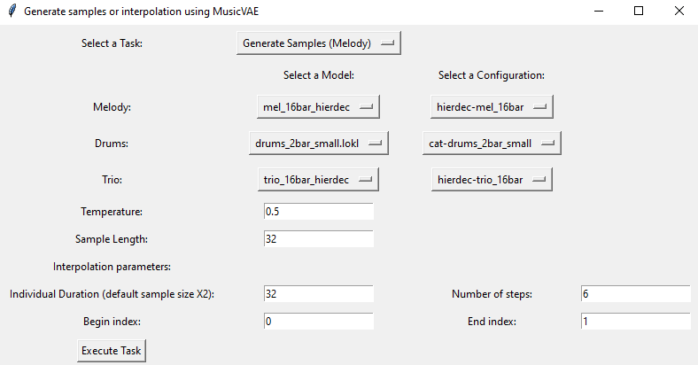

# musicvae_generator
 Generator of samples and interpolations using the MusicVAE model of the Magenta library. Some of this code is generated using ChatGPT as an exercise in pair programming with generative AI.

 This code is only meant for educational purposes.

 Starting point was Colab notebook provided by Google: https://colab.research.google.com/github/magenta/magenta-demos/blob/master/colab-notebooks/MusicVAE.ipynb
 Uses pre-trained checkpoints provided by Google: https://goo.gl/magenta/js-checkpoints

# motivation

I wanted to make music with maching learning using python. The magenta library allowed me to do that. I wanted to be able to interpolate between two melodies to create actual music.

# technical specs

The magenta library only works for python 3.6 to 3.7.

